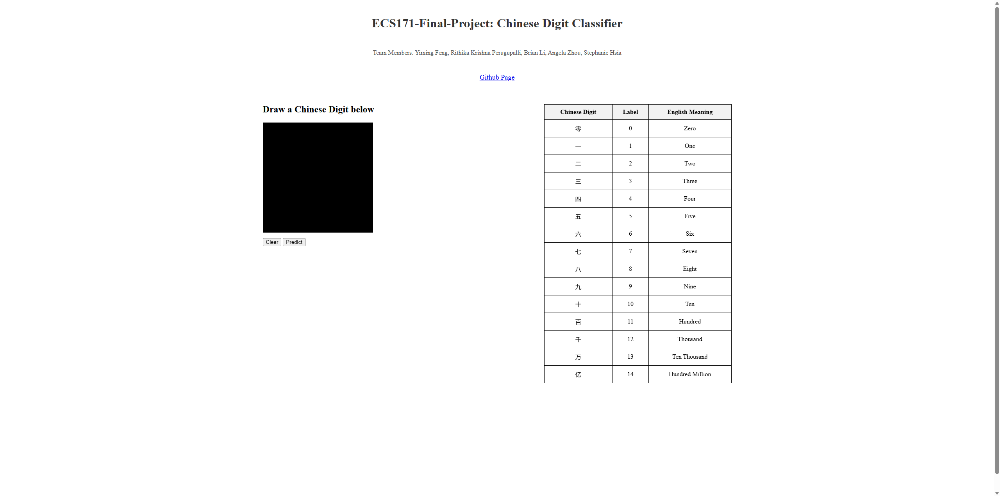

# Chinese Digit Classifier

A deep learning project that classifies handwritten Chinese numerals (0-9, 10, 100, 1000, 10000, 1000000) using VGG16 and LeNet architectures, achieving ~97% accuracy on the Chinese MNIST dataset.

---

## Demo

**Live Demo:** [chinese.quiet98k.com](https://chinese.quiet98k.com)



---

## Features

- **Multi-Model Architecture** — VGG16 and LeNet models optimized for handwritten character recognition
- **Comprehensive EDA** — Edge detection, PCA visualization, and intra-class consistency analysis
- **Data Augmentation Pipeline** — Random rotation (±30°) for robust training
- **Hyperparameter Tuning** — Grid search over learning rates, batch sizes, dropout, and optimizers

---

## Run the Demo

```bash
git clone https://github.com/quiet98k/Chinese-Digit-Classifier.git
cd Chinese-Digit-Classifier
docker-compose up --build
```

Open [http://localhost:3788](http://localhost:3788) in your browser.

---

## Model & Training

### Dataset
- **Chinese MNIST** — 15,000 handwritten samples from 100 volunteers
- 15 classes: digits 0-9 plus 十 (10), 百 (100), 千 (1000), 万 (10000), 亿 (1000000)
- 64×64 grayscale images

### Architectures

| Model   | Parameters | Description                                      |
|---------|------------|--------------------------------------------------|
| **VGG16** | ~15M     | Deep CNN with batch normalization and dropout    |
| **LeNet** | ~62K     | Lightweight model for faster inference           |

### Training Pipeline
- **Data Augmentation:** Random rotation (±30°), edge detection preprocessing
- **Optimization:** SGD/Adam with learning rate scheduling, L2 regularization
- **Hyperparameter Tuning:** Grid search over dropout rates, batch sizes, and epochs

### Evaluation
- **VGG16 Accuracy:** ~97% on test set (best configuration: SGD, lr=0.01, dropout=0.5)
- **LeNet Accuracy:** ~92% on test set

---

## Project Structure

```
Chinese-Digit-Classifier/
├── minst.ipynb             # Training notebook with EDA & model training
├── models/                 # Pre-trained model weights
│   ├── vgg_16_model.pth
│   ├── lenet_model.pth
│   └── best_ResNet_weights.pth
├── best_model.pth          # Best performing model checkpoint
└── README.md
```

---

## License

This project is licensed under the terms specified in the [LICENSE](./LICENSE) file.

